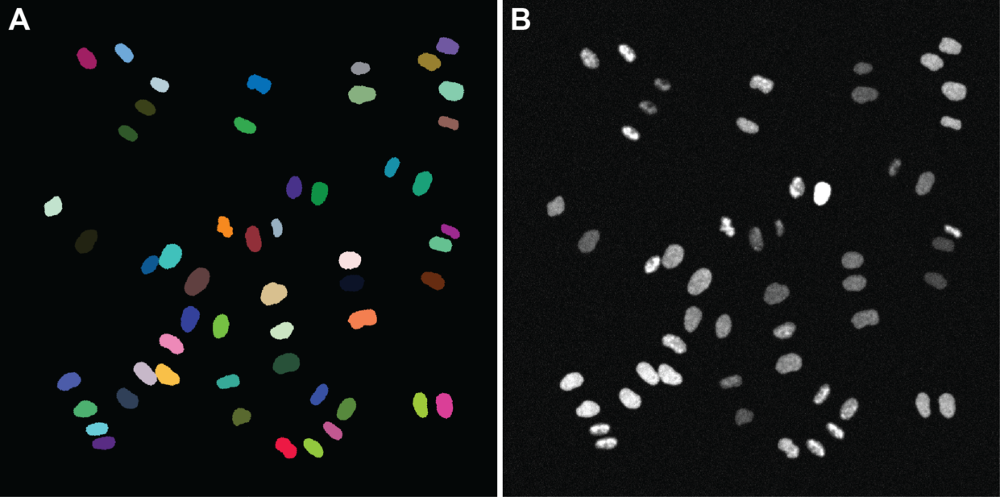

# CellCycleGAN
Spatiotemporal Microscopy Image Synthesis of Cell Populations using Statistical Shape Models and Conditional GANs.

## Installing Dependencies
- CellCycleGAN requires a working MATLAB installation including the image processing toolbox. We tested the software on R2019b (Ubuntu) and R2020a (macOS). 
- Moreover, a Python environment needs to be installed to run the pretrained model files. The repository contains the file `environment.yml` where all the dependencies of the Python scripts are contained. We recommend to use an environment management system such as Anaconda which can be obtained, e.g., from https://docs.conda.io/en/latest/miniconda.html . 
- Start the Anaconda prompt and call the following command to setup a new Python environment called `ccg` with the above-mentioned dependencies: `conda env create -p /path/to/my/environments/ccg -f /path/to/the/file/environment.yml`. 
- After all dependencies have been installed successfully, switch to the environment by calling `conda activate /path/to/my/environments/ccg`. 
- Finally, start MATLAB by invoking the command `matlab` from the terminal. If the command is not found (e.g., if MATLAB was not added to the PATH environment variable before), navigate to the `bin` folder of your MATLAB installation and run MATLAB by starting `./matlab`.

## Ground Truth Preparation
1. Download the supplementary material of Zhong et al., 2012 from https://static-content.springer.com/esm/art%3A10.1038%2Fnmeth.2046/MediaObjects/41592_2012_BFnmeth2046_MOESM257_ESM.zip and extract it to a destination of your choice.
2. Copy the files `ExtractImageData.m` and `SegmentCenterNucleus.m` to the extracted `%SI_ZIP_CONTENT%/code/` folder, create a new directory for the training images and execute the file `ExtractImageData.m`. You'll be asked for an output folder, where you can specify the previously created one.
3. The images from the archive will be processed and written to a `*.h5` format that will be used for CNN training.

## Generation of Synthetic Image Data
- The data generation can be started in MATLAB by executing the script `CellCycleGAN.m`. To make it run properly on your system, you have to adapt at least the output folder path in line 38 (`settings.outputFolder`). 
- After adjusting the output path properly, the script should run and should produce result images. Note that the processing can take a few minutes depending on the number of frames you simulate and on the performance of your machine.
- The Parameters for the data generation are highlighted in the `CellCycleGAN.m` script and can be adjusted according to the desired image quality and to the difficulty level to be generated.
- Note that the script sets the seed for the random generator right in the beginning of the script (`settings.randomSeed`). Make sure to change this seed if you want to generate a different image sequence.
- Results are stored in the Cell Tracking Challenge format (http://celltrackingchallenge.net/) and should thus be usable with the performance evaluation tools of the challenge.

## Citation
If you find this work useful, please cite the following publication: 

D. Bähr, D. Eschweiler, A. Bhattacharyya, D. Moreno-Andrés, W. Antonin, J. Stegmaier, 
"CellCycleGAN: Spatiotemporal Microscopy Image Synthesis of Cell Populations using Statistical Shape Models and Conditional GANs", *arxiv*, 2020.

## References
[1] Zhong, Q., Busetto, A. G., Fededa, J. P., Buhmann, J. M., & Gerlich, D. W. (2012). "Unsupervised Modeling of Cell Morphology Dynamics for Time-Lapse Microscopy". *Nature Methods*, 9(7), 711-713.

[2] Ulman, V., Maška, M., Magnusson, K. E., Ronneberger, O., Haubold, C., Harder, N., ... & Smal, I. (2017). "An Objective Comparison of Cell-Tracking Algorithms". *Nature Methods*, 14(12), 1141-1152.